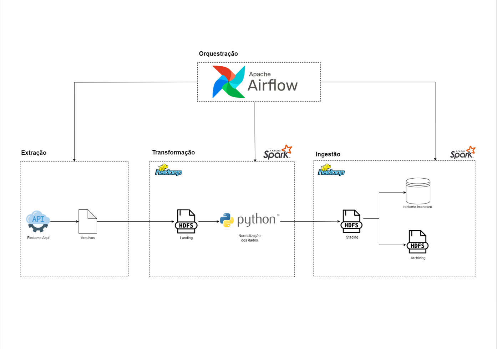

# Projeto Ingestão de dados

### _Desafio proposto (1):_ 🚀

1) Definição de um problema (podem escolher "a gosto")
2) Definição ingestão em dados (local da origem, pode ja existir ou pode ser gerado, qual ferramenta que vão usar)
3) Definição arquitetura (desenho no minimo 2 partes do todo ingestão e amazenamento como sera)
4) Subir no git - 1

## O Projeto

**Engenheiros(as):** Marcos Vinicius Pontarolo, Leandro Florêncio, Larissa Oliveira Pereira, Felipe Gritten e Ana Carolina Alves

“Entre nós, você vem primeiro.”

Os clientes são muito importantes para o Bra e, por isso, a busca pela melhora do atendimento e sua experiência com a empresa é imprescindível.
 
Temos o objetivo de resolver os seguintes problemas em relação a experiência dos clientes na plataforma Reclame Aqui:
 - Otimizar e acelerar o atendimento ao cliente e a resolução de seus problemas.
 - Avaliar a eficácia das soluções propostas ao final do atendimento.
 - Avaliar seu nível de satisfação e sentimentos em relação a empresa em cada etapa.
 
Propomos a seguinte solução:

Faz-se necessário extrair os dados da plataforma para que sejam utilizados em nossas análises. O Reclame Aqui disponibiliza APIs para possibilitar a coleta destes dados. Desta forma, definimos as ferramentas e tecnologias que, em nossa visão, se enquadram para realizar os processos de Extração, Transformação e Carregamento dos dados.

## Diagrama de Ingestão:

### _Desafio proposto (2):_ 🚀

5) Definição de uma camada de processamento
6) Definição de uma camada de exploração
7) Definição de uma camada de disponibilização
8) Pesquisa de ferramentas (ex qual a motivação de usar as ferramentas escolhidas)

## O Projeto (Seguimento)

Ferramentas utilizadas:

 - **Hadoop:** Processamento de grande volume de dados em cluster
 - **Spark / Python:** Velocidade, Fácil de usar, generalidade, conexão com Python
 - **Airflow:** Orquestração e schedule de processos Python - Tratamento de dados
 - **Power Bi:** Construção de relatorios e Dashboards de forma eficaz

## Diagrama de Ingestão (novas implementações):

